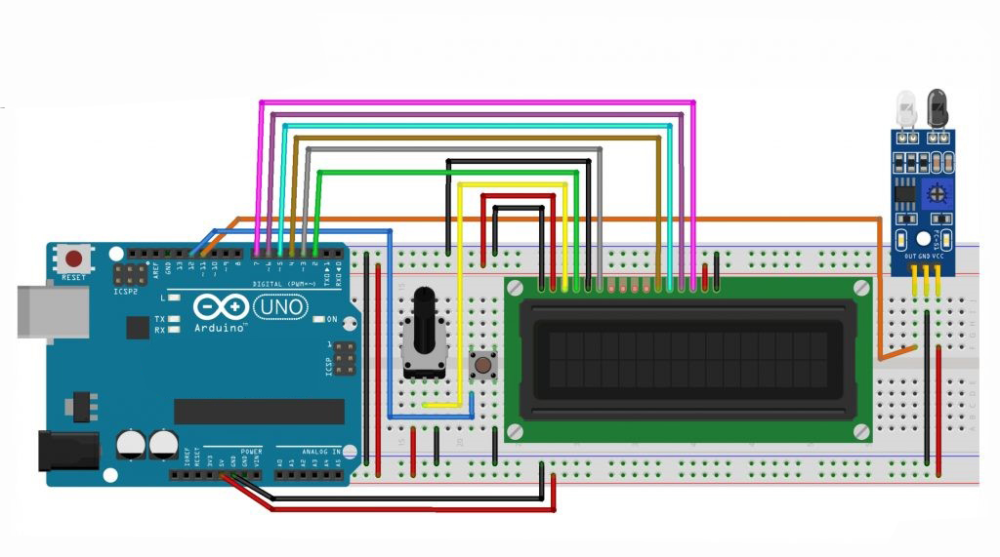

## Object Counter based on Arduino Uno (Incoming Item Counter Based On Arduino Uno)

## Description

- The FC-51 infrared sensor module is a sensor that works to detect objects or obstacles in front of the sensor module. The FC-51 infrared sensor module has two main parts consisting of an IR transmitter and an IR receiver. The function of the IR transmitter is the part that is tasked with emitting infrared radiation to an object or obstacle. While the IR receiver is the part that functions to detect radiation that has been reflected by an object that comes from the IR transmitter. When connected to Arduino, this sensor can be used as an incoming goods counter.

## Component (Tools & Material)=

- Arduino = 1 unit; <br/>
- Breadboard / ProjectBoard = 1 unit;<br/>
- LCD 16×2 = 1 unit;<br/>
- Sensor FC-51 = 1 unit;<br/>
- Potensiometer 10kΩ = 1 unit;<br/>
- Push button (for reset) = 1 unit;<br/>
- Resistor = 1 unit
- Jumper wires

## Schematic:



## Wiring Information:

- Pin on LCD: <br/>
  • Pin VSS – Ground <br/>
  • Pin VDD – 5V <br/>
  • Pin VO – Potensio <br/>
  • Pin RS – Pin 2 Arduino <br/>
  • Pin R_W – Ground <br/>
  • Pin E – Pin 3 Arduino <br/>
  • Pin DB4 – Pin 4 Arduino <br/>
  • Pin DB5 – Pin 5 Arduino <br/>
  • Pin DB6 – Pin 6 Arduino <br/>
  • Pin DB7 – Pin 7 Arduino <br/>
  • Pin A – 5V <br/>
  • Pin K – Ground <br/>
- Pin on Arduino: <br/>
  • Pin 11 – Pin Output Sensor FC-51 <br/>
  • Pin 12 – Pin Button <br/>

## Sketch Program

````cpp
```cpp
#include <LiquidCrystal.h>

LiquidCrystal lcd(2, 3, 4, 5, 6, 7);  // Define LCD pins
const int pinSensor = 11;  // Sensor pin
const int pinReset = 12;   // Reset button pin
int hitung = 0;            // Counter variable
int kondisi1 = 0;          // Condition for counting
int status1;

void setup() {
    pinMode(pinReset, INPUT_PULLUP);  // Set reset button as input
    pinMode(pinSensor, INPUT);        // Set sensor as input
    digitalWrite(pinReset, HIGH);     // Pull reset pin high
    lcd.begin(16, 2);                 // Initialize LCD
    lcd.clear();
    lcd.setCursor(0, 0);
    lcd.print("Ready");               // Display "Ready" message
    delay(2000);
}

void loop() {
    hitung = constrain(hitung, 0, 1000);  // Limit count between 0 and 1000
    status1 = digitalRead(pinSensor);     // Read sensor status

    if (status1 == HIGH) {                // If object detected
        hitung = hitung;
        kondisi1 = 0;                     // Reset condition
    }
    else if (status1 == LOW && kondisi1 == 0) {
        hitung += 1;                      // Increment counter
        kondisi1 = 1;                     // Set condition
    }
    else if (status1 == LOW && kondisi1 == 1) {
        hitung = hitung;
        kondisi1 = 1;
    }

    if (digitalRead(pinReset) == LOW) {   // If reset button pressed
        hitung = 0;                       // Reset counter
    }

    lcd.clear();                          // Clear LCD
    lcd.setCursor(0, 0);
    lcd.print("Jumlah Barang : ");        // Display label
    lcd.setCursor(0, 1);
    lcd.print(hitung);                    // Display count
    delay(300);
}

````

## Conclusion:

- Here is the complete README.md file for your Object Counter based on Arduino Uno project using the provided .ino code:

md

# Object Counter based on Arduino Uno

## Description:

This project uses an Arduino Uno and a sensor to count the number of objects passing by. The count is displayed on a 16x2 LCD screen. The system also includes a reset button to clear the count. The object detection is handled by a sensor connected to the Arduino, and the counter increases as each object passes the sensor.

## Components (Tools & Materials):

- Arduino Uno = 1 unit
- 16x2 LCD Display = 1 unit
- Sensor (e.g., IR or proximity sensor) = 1 unit
- Pushbutton (for reset) = 1 unit
- Resistor = 1 unit
- Jumper wires
- Breadboard

## Circuit Schematic:


## Wiring Information:

- LCD Pin D4 to Arduino Pin 2
- LCD Pin D5 to Arduino Pin 3
- LCD Pin D6 to Arduino Pin 4
- LCD Pin D7 to Arduino Pin 5
- LCD Pin RS to Arduino Pin 6
- LCD Pin E to Arduino Pin 7
- Sensor Pin to Arduino Pin 11
- Reset Button Pin to Arduino Pin 12

## Sketch Program:

```cpp
#include <LiquidCrystal.h>

LiquidCrystal lcd(2, 3, 4, 5, 6, 7);  // Define LCD pins
const int pinSensor = 11;  // Sensor pin
const int pinReset = 12;   // Reset button pin
int hitung = 0;            // Counter variable
int kondisi1 = 0;          // Condition for counting
int status1;

void setup() {
    pinMode(pinReset, INPUT_PULLUP);  // Set reset button as input
    pinMode(pinSensor, INPUT);        // Set sensor as input
    digitalWrite(pinReset, HIGH);     // Pull reset pin high
    lcd.begin(16, 2);                 // Initialize LCD
    lcd.clear();
    lcd.setCursor(0, 0);
    lcd.print("Ready");               // Display "Ready" message
    delay(2000);
}

void loop() {
    hitung = constrain(hitung, 0, 1000);  // Limit count between 0 and 1000
    status1 = digitalRead(pinSensor);     // Read sensor status

    if (status1 == HIGH) {                // If object detected
        hitung = hitung;
        kondisi1 = 0;                     // Reset condition
    }
    else if (status1 == LOW && kondisi1 == 0) {
        hitung += 1;                      // Increment counter
        kondisi1 = 1;                     // Set condition
    }
    else if (status1 == LOW && kondisi1 == 1) {
        hitung = hitung;
        kondisi1 = 1;
    }

    if (digitalRead(pinReset) == LOW) {   // If reset button pressed
        hitung = 0;                       // Reset counter
    }

    lcd.clear();                          // Clear LCD
    lcd.setCursor(0, 0);
    lcd.print("Jumlah Barang : ");        // Display label
    lcd.setCursor(0, 1);
    lcd.print(hitung);                    // Display count
    delay(300);
}
```

## Conclusion:

- This project is a simple object counter that uses a sensor to detect passing objects and display the count on an LCD. The system includes a reset button to reset the counter to zero. This project can be used for applications such as counting products on a conveyor belt or tracking the number of people entering a room.

- This project is an automatic item counter using infrared proximity sensor and the result will be displayed on 16×2 LCD screen. This tool is also equipped with reset button.
